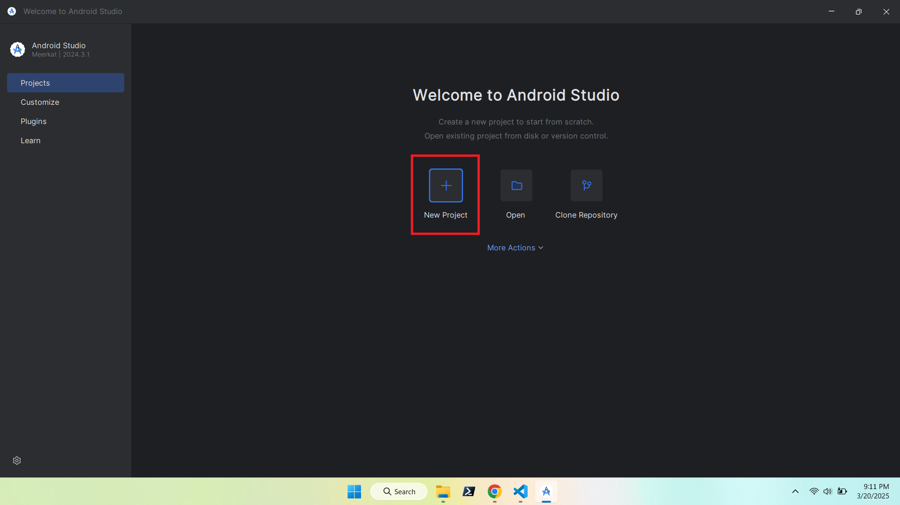
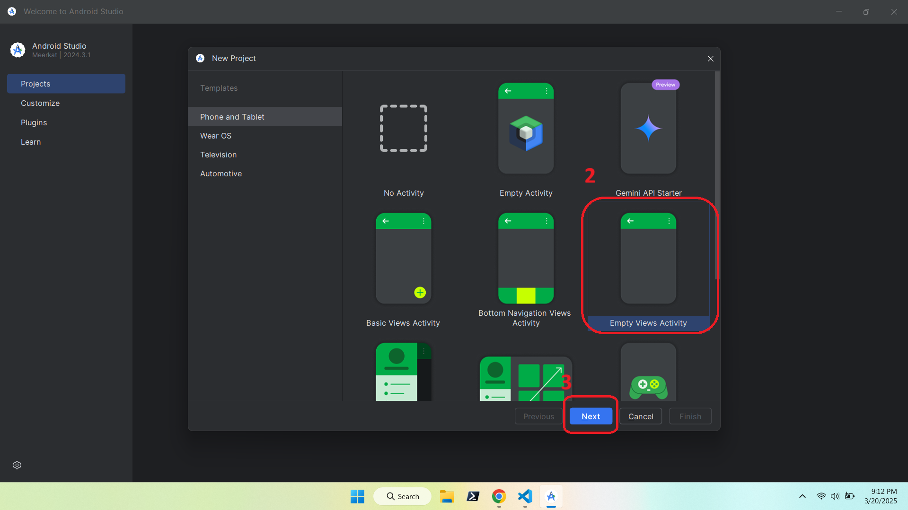
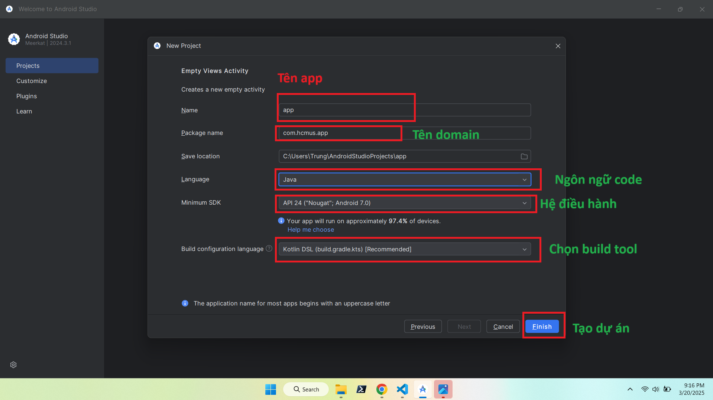
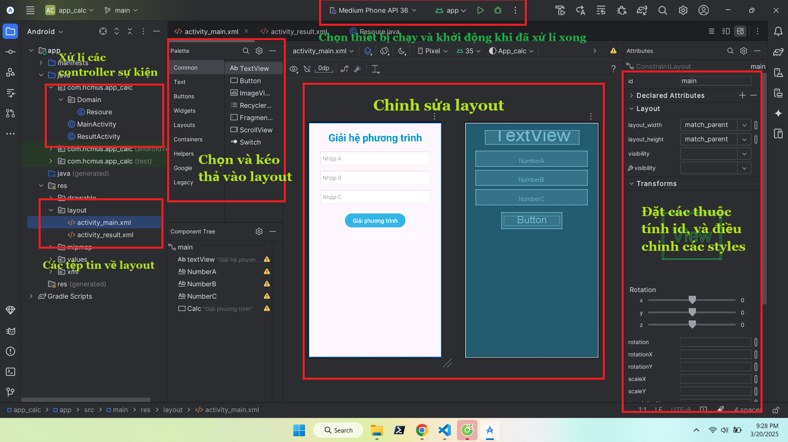
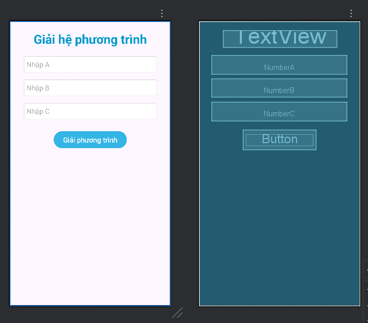
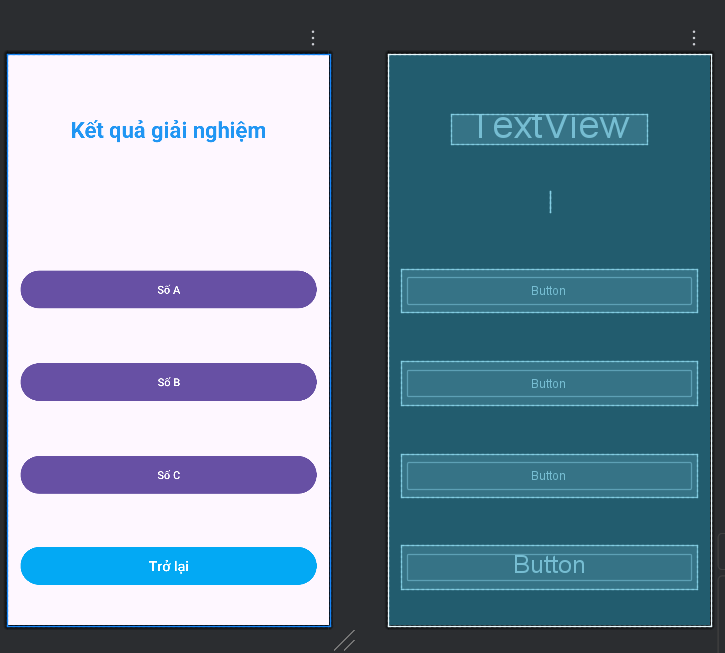

# 📱 Android App: Tính toán phương trình bậc 2

Ứng dụng Android giúp giải phương trình bậc 2 với giao diện đơn giản, dễ sử dụng.

---
## 🎬 Chương trình ứng dụng và kiểm thử


---

##  🎬 Xem tại Youtube
[](https://youtube.com/shorts/cNMM3-NPei0)

---

## 🚀 1. Tạo Project mới trong Android Studio
Tạo một dự án mới trong **Android Studio**:


---

## 🏗️ 2. Chọn loại Activity
Chọn **Basic View Activity** để có giao diện cơ bản:


---

## ✏️ 3. Đặt tên project và chọn cấu hình Android
Nhập tên ứng dụng, package name, và chọn ngôn ngữ **Java/Kotlin**:


---

## 🖥️ 4. Màn hình chính trong Android Studio
Khi mở dự án, bạn sẽ thấy giao diện chính gồm **XML Layouts** và **MainActivity**:


---

## 🎨 5. Thiết kế giao diện (Layout)

### 🔹 Main Activity (Nhập hệ số phương trình)
Màn hình chính để nhập **a, b, c** của phương trình bậc 2:


### 🔹 Result Activity (Hiển thị kết quả)
Màn hình hiển thị **nghiệm của phương trình** sau khi tính toán:


---

## ⚙️ 6. Cách hoạt động

1. **Người dùng nhập giá trị** của `a, b, c`.
2. Nhấn nút **Giải phương trình**.
3. Ứng dụng sẽ tính **nghiệm x1, x2** bằng công thức:
   ```math
   x = \frac{-b \pm \sqrt{b^2 - 4ac}}{2a}
   ```
4. Hiển thị kết quả trong **Result Activity**.

---

## 🛠️ 7. Cách chạy ứng dụng

1. Clone repo này về máy:
   ```sh
   git clone https://github.com/Trung78z/AndroidApp_calc.git
   ```
2. Mở **Android Studio** và import project.
3. Chạy ứng dụng trên **Emulator** hoặc **thiết bị thật**.
4. Nhập hệ số phương trình và xem kết quả.


---

## 📩 8. Liên hệ
Nếu có thắc mắc hoặc góp ý, vui lòng liên hệ qua email: `trungpspy@gmail.com`.